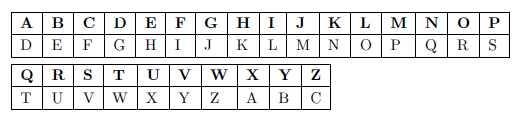

# Criptografia de Cesar

Acredita-se que cifras de mudança de alfabeto tenham sido usadas por Júlio César há mais de dois mil anos. Este é um exemplo com _k = 3_. Em outras palavras, as letras no alfabeto são deslocadas três posições em uma direção para criptografar e três na outra direção para descriptografar.

* Parte 1: criar um programa que o usuário digite uma palavra e imprima a palavra criptografada com _**k = 2**_

* Parte 2: criar um programa que o usuário digite uma palavra e imprima a palavra criptografada com qualquer valor de k.

Regras para entrega:
- pode ser feito em dupla
- deve ser entregue dois arquivos em python
- regra de nome de arquivo:
  * _XX_exercicio_01_p1.py_ ou _XX_YY_exercicio_01_p1.py_
  * _XX_exercicio_01_p2.py_ ou _XX_YY_exercicio_01_p2.py_